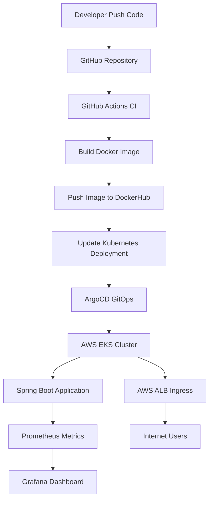

# DevOps GitOps Demo – Spring Boot on AWS EKS 🚀

GitOps-based CI/CD pipeline deploying a **Spring Boot application to AWS EKS** with monitoring and cloud-native infrastructure.


---

This project demonstrates a **complete DevOps workflow in the cloud** using:

* Docker
* GitHub Actions
* Kubernetes
* AWS EKS
* ArgoCD (GitOps)
* Prometheus
* Grafana
* AWS Load Balancer

The goal is to show how an application can be **automatically built, deployed, monitored and exposed to the internet** using modern DevOps tools.

---

# Architecture



---

# Features

* Automated CI/CD pipeline
* Docker image build and push
* GitOps deployment with ArgoCD
* Kubernetes deployment on AWS EKS
* Prometheus monitoring
* Grafana dashboards
* Application exposed through AWS ALB
* Cloud-native infrastructure

---

# Project Structure

```
new-web-eks
│
├── .github/workflows
│   └── ci.yml
│
├── k8s
│   ├── app
│   │   ├── deployment.yaml
│   │   ├── service.yaml
│   │   └── ingress.yaml
│   │
│   └── monitoring
│       └── service-monitor.yaml
│
├── src
│
├── Dockerfile
├── cluster.yaml
└── README.md
```

---

# CI/CD Pipeline

Developer pushes code to GitHub

GitHub Actions builds Docker image

Image pushed to Docker Hub

ArgoCD detects manifest changes

Kubernetes updates the application

---

# Monitoring

Prometheus collects metrics from:

```
/actuator/prometheus
```

Metrics are discovered using **ServiceMonitor**.

---

# Grafana Dashboard

Grafana dashboards visualize application metrics such as:

* request rate
* response time
* error rate

---

# Infrastructure

EKS cluster created using:

```
eksctl
```

Cluster configuration:

```
cluster.yaml
```

Cluster nodes:

```
2 × t3.small
```

Application exposed through:

```
AWS Application Load Balancer (ALB)
```

---

# Access Application

Example URL:

```
http://<aws-alb-url>
```

Response:

```
Hello Mahmoud 🚀
```

---

# Future Improvements

* HTTPS with cert-manager
* Custom domain
* Terraform infrastructure
* Horizontal Pod Autoscaler
* Canary deployments

---

# Author

Mahmoud Ghanem

DevOps learning project demonstrating **GitOps deployment on AWS EKS**.
